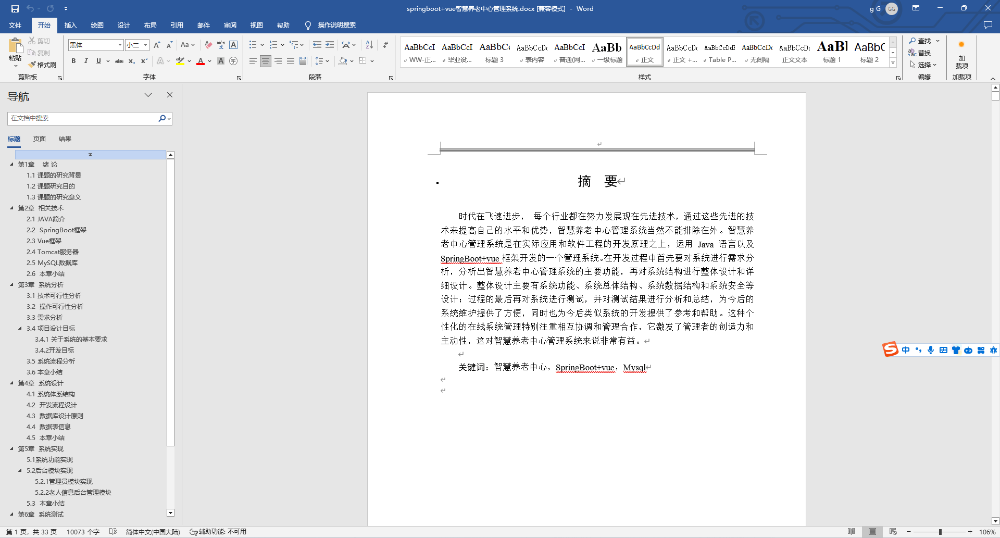
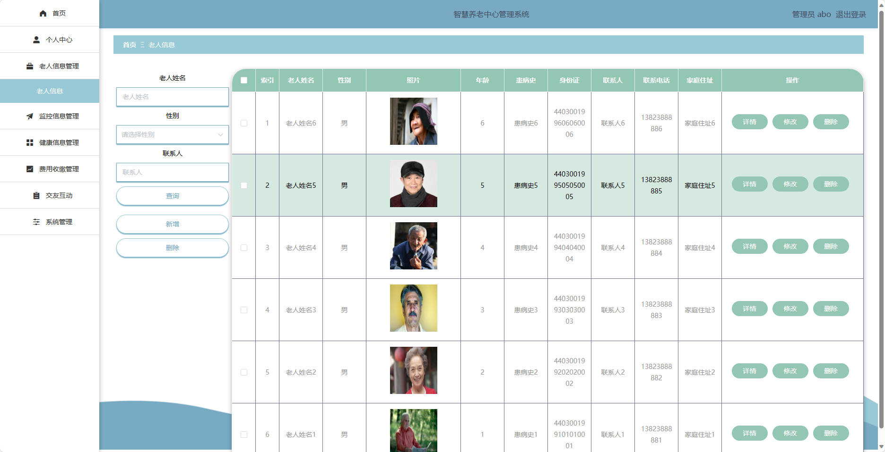
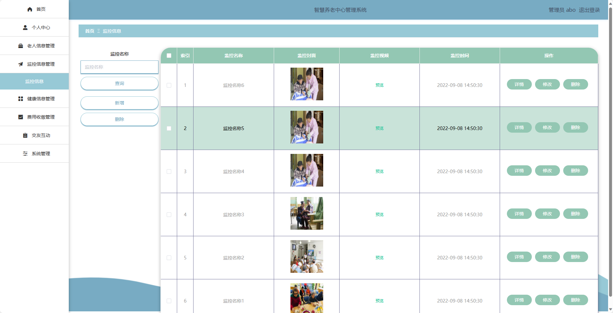
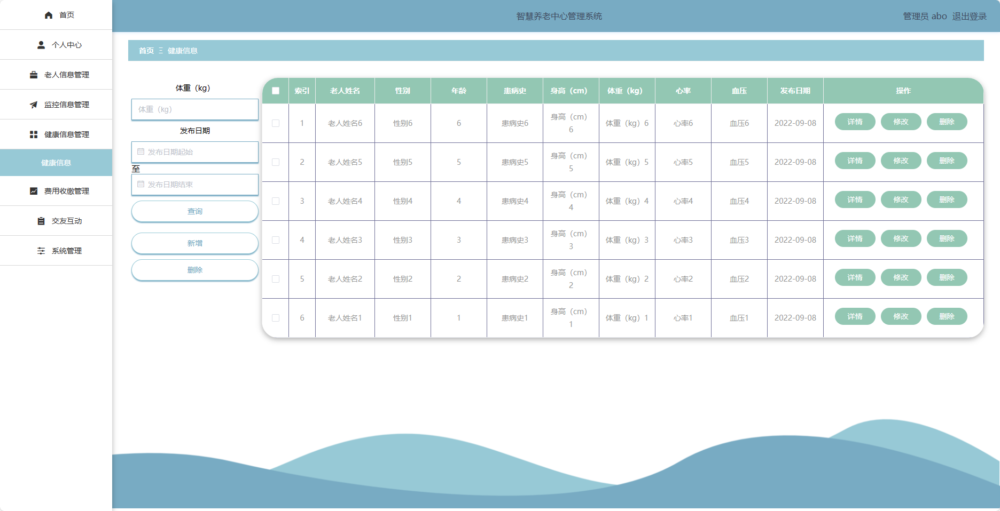
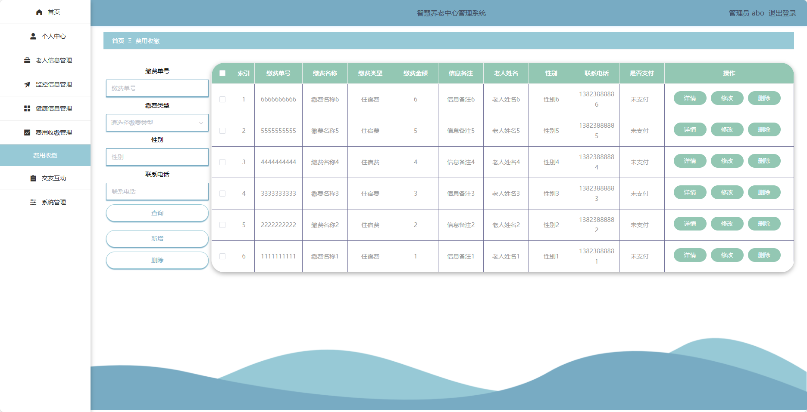
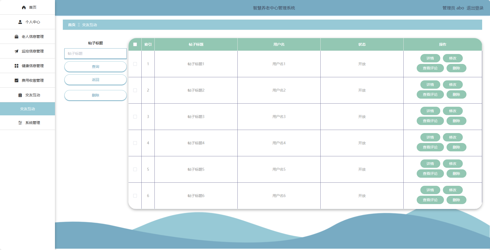
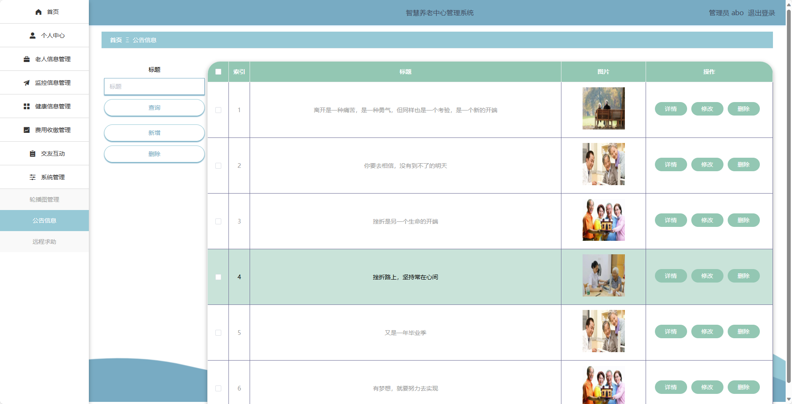
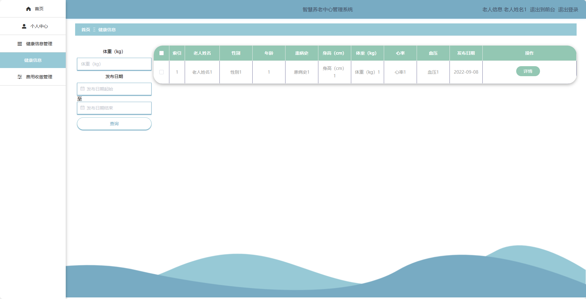
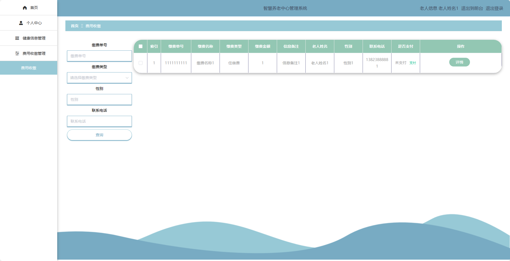
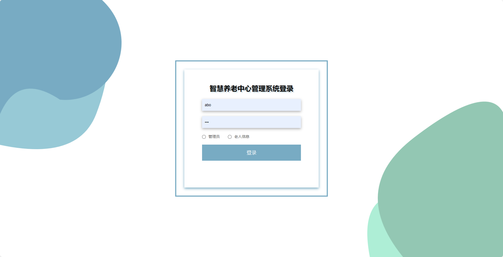

## 基于SpringBoot的智慧养老中心管理系统(程序+报告)

###  获取sql数据库文件: 从戎源码网 (https://armycodes.com/) QQ: 386869957 QQ群: 377586148
###  所有系统地址: (https://github.com/YuLin-Coder/AllProjectCatalog) 
###  所有项目以及源代码本人均调试运行无问题 可支持远程安装部署调试、定制修改、代码讲解

## 项目介绍
基于SpringBoot的智慧养老中心管理系统，系统包含两种角色：管理员、用户，主要功能如下。

### 【管理员】:
- 个人中心：管理员可以管理个人信息，修改密码等。
- 老人信息管理：管理员可以管理老人的基本信息，包括添加、编辑和删除老人信息。
- 监控信息管理：管理员可以管理监控设备的信息，包括添加、编辑和删除监控设备信息。
- 健康信息管理：管理员可以管理老人的健康信息，包括添加、编辑和删除健康信息。
- 费用收缴管理：管理员可以管理老人的收费信息，包括查看和修改收费信息。
- 交友互动：管理员可以为老人提供交友互动平台，包括发布话题、评论回复等。
- 系统管理：管理员可以管理系统的相关配置，包括日志管理、权限管理等。
- 轮播图管理：管理员可以管理轮播图的展示内容，包括添加、编辑和删除轮播图信息。
- 公告信息：管理员可以发布公告信息。
- 远程求助：管理员可以为老人提供远程求助服务。

### 老人角色：
- 个人中心：老人可以管理个人信息，查看个人健康信息，修改密码等。
- 健康信息管理：老人可以输入自己的健康状况。
- 费用收缴管理：老人可以查看自己的收费信息。

## 项目技术
- 编程语言：Java
- 数据库：MySQL
- 项目管理工具：Maven
- 前端技术：HTML、CSS、JavaScript、Jquery、Vue
- 后端技术：Spring、SpringMVC、MyBatis

## 运行环境
- JDK版本：JDK1.8及以上
- 开发工具：IDEA、Ecplise、Myecplise都可以
- 数据库: MySQL5.7及以上
- Maven：maven3.0及以上
- Node：14.14.0及以上

## 运行截图

